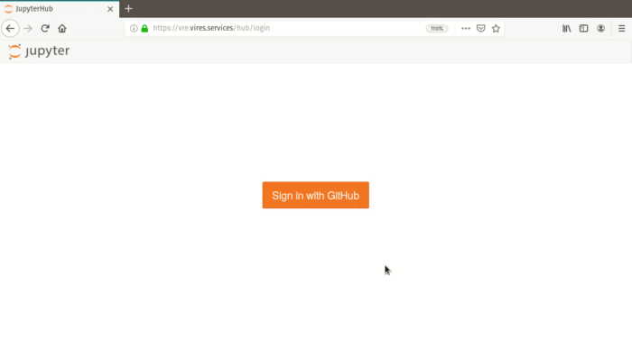
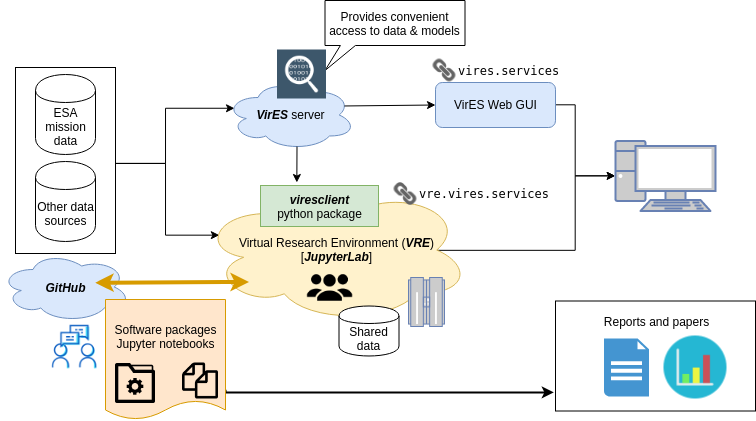

# ℹ️ Introduction to the VRE

The VRE is a cloud service based on *Jupyter* technology to lower the barrier to entry for researchers to use *Swarm* products. We provide the hardware and the software stack so that you can start programming immediately without configuring anything on your computer. Data and software are stored and executed in the cloud.

The VRE is an extension of VirES [(**Vir**tual environments for **E**arth observation **S**cientists)](https://vires.services) - a server system and a graphical web interface to allow easy visualisation and manipulation of Swarm products (both data and geomagnetic models). With the VRE you are now able to bring the Jupyter & Python ecosystem to data retrieved via VirES. Both services are provided by ESA through [EOX IT Services](https://eox.at/).

The goal of this project is to reduce the hurdles that researchers face in data and software management, and to empower them to build more interoperable and reproducible research code. While you can run code on the VRE without any initial setup, we also fully support accessing data from VirES on any machine through the [viresclient](https://viresclient.readthedocs.io) Python package.

## What is Jupyter?

[*Project Jupyter*](https://jupyter.org/) is a broad open-source project to build tools and standards for interactive computing. [*JupyterLab*](https://jupyterlab.readthedocs.io/) is their flagship creation which brings a development environment to the web, targeting the workflows of (data) scientists based around *Jupyter Notebooks*: computational notebooks which weave live code with narrative, extensible with interactive elements. 

:::{admonition} There are many other projects integrating with the Jupyter ecosystem - some highlights:
:class: seealso
- Guides to making use of JupyterLab & Python:
    - [Jupyter Meets the Earth](https://pangeo-data.github.io/jupyter-earth/jupyter-resources/ecosystem/jupyterlab.html) - Introduction for Scientists
    - [Software Carpentry Python course](https://swcarpentry.github.io/python-novice-gapminder/)
    - [Project Pythia](https://projectpythia.org/pages/links.html) - A Community Educational Resource for Geoscientists
    - [Data 8](http://data8.org/) - UC Berkeley Foundations of Data Science course
    - [Teaching and Learning with Jupyter](https://jupyter4edu.github.io/jupyter-edu-book/) - A handbook for educators
- Wider software & infrastructure projects
    - [Pangeo](https://pangeo.io/) - A community platform for Big Data geoscience
    - [Resen](https://ingeo.datatransport.org/home/resen) - "REproducable Software ENvironment" targeting reproducability in geospace science

